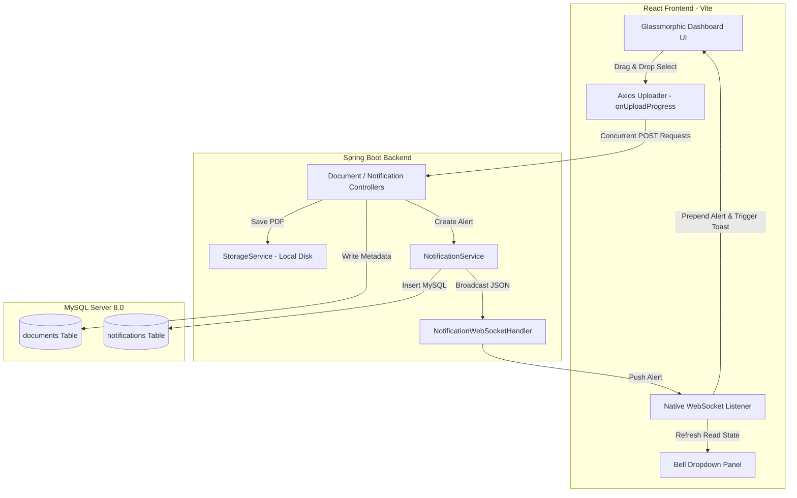

# Aether Docs - Real-Time Document Management Dashboard

A high-performance, premium-designed full-stack Document Management Dashboard that enables users to upload PDF documents, track individual upload progress bars in real-time, handle asynchronous bulk background uploads with smart notification toasts, and view persistent alert records inside a glassmorphic notification center.

Built using a state-of-the-art tech stack consisting of **React (Vite) + Vanilla CSS**, **Spring Boot (Java 21)**, **Spring Data JPA**, and **MySQL**.

---

## Technical Architecture & Flow



---

## 🛠️ Step-by-Step Local Setup & Execution Guide

### 1. Database Setup (MySQL)
The application is pre-configured to connect to your local MySQL database.
*   **Database URL**: `jdbc:mysql://localhost:3306/document_db`
*   **Username**: `root`
*   **Password**: `Ajaybalaji2115$`
*   *Note: On startup, Spring Boot will automatically create the database `document_db` and generate all tables (`documents` and `notifications`) if they do not exist.*

---

### 2. Launch Backend (Spring Boot)
Open your terminal inside the `backend` folder and run the Maven development command:
```bash
cd backend
mvn spring-boot:run
```
*   The server will start on port **`8080`**.
*   Verify it is running by hitting `http://localhost:8080/api/documents` in your browser.

---

### 3. Launch Frontend (React + Vite)
Open a separate terminal window inside the `frontend` folder and run:
```bash
cd frontend
npm install
npm run dev
```
*   The Vite dev server will boot on port **`5173`**.
*   Open `http://localhost:5173` in your browser to view the glassmorphic dashboard interface!

---

## 🚀 How to Expose & Generate the Live Link (Public Tunnel)

To share the application or view it on external devices, you can generate an instant, secure HTTPS public tunnel using standard, zero-config tools. 

Launch a new terminal window and run either of these options:

### Option A: Using Localtunnel (Recommended)
This exposes your frontend dev server on port `5173` globally:
```bash
npx localtunnel --port 5173
```
*Localtunnel will output a public HTTPS link (e.g. `https://cool-docs-jump.loca.lt`) which you can share as your active Live Link!*

### Option B: Using Pinggy (SSH-based, zero installation)
If you don't wish to use `npx`, you can use standard SSH to tunnel:
```bash
ssh -p 443 -R0:localhost:5173 qr@a.pinggy.io
```
*This output will show a glowing secure URL pointing directly to your local React dev server.*

---

## 🧪 Running the Test Suite

We have written MockMvc-based integration tests to validate crucial backend API operations:
*   Document listing endpoints.
*   Notification CRUD listings.
*   Marking alert read statuses.

To execute the test suite, run:
```bash
cd backend
mvn test
```
*You will see a test execution summary showing green checkmarks for all endpoint validation suites.*

---

## 💎 Features Walkthrough

1.  **Individual Upload Progress Bar**: Select 1 to 3 PDFs. The interface registers distinct XHR upload streams, rendering separate percentage-based visual indicators.
2.  **Smart Asynchronous Bulk Uploads**: Upload 4 or more PDFs simultaneously. The UI instantly fires all streams in parallel, shows a background processing banner, and collapses the progress trackers to avoid crowding the layout.
3.  **Real-Time Notifications**: Once the bulk upload finishes processing on the backend, the Spring WebSocket server broadcasts a JSON message. The frontend receives it instantly (even if navigated away) and spawns an auto-dismissing visual toast notification.
4.  **Notification Hub dropdown**: Bell icon in the header dynamically keeps count of unread notifications, offering clear visual dots for read/unread files and individual/bulk marks.
